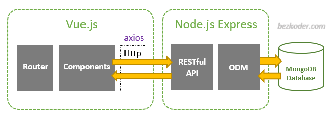

#### ♦ Instalar Menv CLI: npm install -g mevn-cli
#### ♦ Instalar dependencias em ./proj/server e em ./proj/client: npm install

##### ♦ Iniciar App em ./proj: mevn serve

--------

#### ♦ Configurar e utilizar a BD:
    - Instalar MongoDB Community Version
    - Utilizar Postman
    - Criar Collection (tabela)
    - Usar operações POST, GET, PUT, DELETE em localhost:9000/api
    -   .post('/', createData)
        .get('/', readData)
        .put('/:id', updateData)
        .delete('/:id', deleteData);
    - Selecionar "Body", vista "raw" e formato JSON
    - Escrever no editor um objeto, por ex: {name: João, age: 20}
    - Send
        

------------

